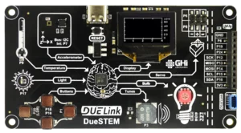

# DUELink DueSTEM

This page is a `Getting Started` page for `DUELink DueSTEM`. The full product details are [here](https://www.duelink.com/docs/products/mcduestem-b) on the main DUELink website. Are you an educator? See how DUELink can help you [here](https://www.duelink.com/docs/educators).

Don't have a DUELink DueSTEM yet? Get yours today! 

 

---

This was moved to: [www.duelink.com/docs/tutorial/duestem](https://www.duelink.com/docs/tutorial/duestem)
